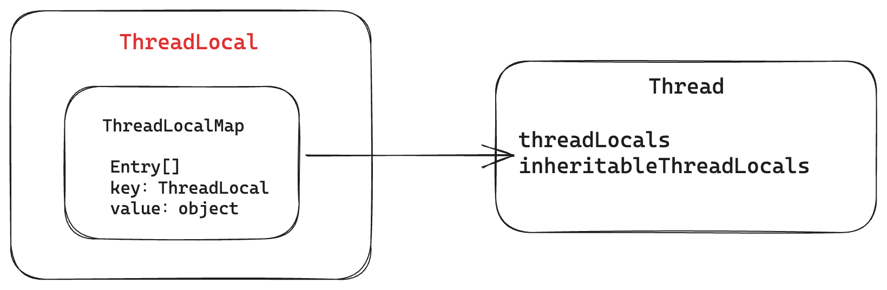

# 什么是线程缓存以及为什么要用到线程缓存？
每个线程都有独立的存储空间，使得相同的变量在不同线程中能够有不同的值，互不影响，每个变量只在当前线程中使用。简单来说就是**多线程环境下解决线程安全问题的工具**。

线程缓存相比于其他缓存，具有以下优点：
- **性能更优**，直接存于线程变量副本中，没有其他 IO 开销，同时避免了锁同步的开销
- **数据隔离**，多线程中天然不存在竞争，保证每个线程对数据的修改不会影响其他线程中的变量
- **简化代码**，需要在多个层次的调用中传递数据的场景中，使用线程缓存可以简化参数传递逻辑，避免在方法调用中显式传递参数，从而提高代码的可读性（**双刃剑**）。

线程缓存典型的使用场景：
- 数据库连接对象：使用池化技术加线程缓存来使用和管理数据库连接
- 用户上下文信息：RPC 请求中通过拦截器记录一些公共参数，如用户信息、客户端信息

```java
ExecutorService executorService = Executors.newFixedThreadPool(5);  
ThreadLocal<String> threadLocal = new ThreadLocal<>();  
threadLocal.set("threadLocal1");  
System.out.println(Thread.currentThread().getName() + "=" + threadLocal.get());  // threadLocal1
executorService.submit(() -> {  
    System.out.println(Thread.currentThread().getName() + "=" + threadLocal.get());  // null
    threadLocal.set("threadLocal2");  
    System.out.println(Thread.currentThread().getName() + "=" + threadLocal.get());  // threadLocal2
});  
Thread.sleep(1000);  
System.out.println(Thread.currentThread().getName() + "=" + threadLocal.get());	// threadLocal1
```

# ThreadLocal 分析
## Thread与ThreadLocal关系
Thread 类中有threadLocals、inheritableThreadLocals两个变量，负责存储当前线程的缓存对象。
变量可以保存多个对象，通过数组对象进行存储，其中对象的 key 为ThreadLocal，value 为 object 对象。


其中inheritableThreadLocals 保存的是可继承的线程变量，基本原理是创建子线程时把父线程的inheritableThreadLocals对象深拷贝到当前线程变量中。

以线程池新建线程为例，跟踪代码实现：
```java
ExecutorService executorService = Executors.newFixedThreadPool(5);

Executors.DefaultThreadFactory

DefaultThreadFactory.newThread

Thread(ThreadGroup g, Runnable target, String name,  
               long stackSize, AccessControlContext acc,  
               boolean inheritThreadLocals) {// inheritThreadLocals默认为 true
               if (inheritThreadLocals && parent.inheritableThreadLocals != null)  // 深拷贝父线程（即当前创建线程）的inheritThreadLocals对象
    this.inheritableThreadLocals =  
        ThreadLocal.createInheritedMap(parent.inheritableThreadLocals);
               } 
```
## ThreadLocalMap 设计
可以看到ThreadLocalMap并没有实现 Map接口，而是定义了一个Entry数组来保存所有数据，在我看来这种设计有以下几点好处：
- **保持代码的简洁性**，如果实现 map 接口，需要实现接口下的所有方法，其中一些方法在线程缓存场景是用不到的，增加了代码维护成本
- **性能与存储考虑**，通过数组以及线性探测法，能够减少链表带来的存储与查询成本
- **定制的垃圾回收策略**，通过 key 的弱引用设计，尽量减少内存泄露的发生。
```java
static class ThreadLocalMap {  
	private Entry[] table;
	
    static class Entry extends WeakReference<ThreadLocal<?>> {  
        Object value;  
  
        Entry(ThreadLocal<?> k, Object v) {  
            super(k);  // k 为弱引用，当只有弱引用存在时，只要发生 gc 就会被垃圾回收，此时 key 为 null，下次 set 时会进行清理。
            value = v;  // v为强引用，
        }  
    }
}
```
ThreadLocal 为了防止内存泄露，会有一个兜底清除的机制（弱引用的设计 && 垃圾清理设计）。这种兜底机制的设计使得即使开发者偶尔忘记调用 remove()，系统也能在其持续操作中消除大部分不必要的遗留；不过，开发中仍然应该严格执行移除操作。


> Java 中不同引用的介绍
> - 强引用：new 对象的方式即强引用，对象只要存在强引用就不会进行垃圾回收
> - 软引用：没有强引用存在时，若内存不足才会进行垃圾回收
> - 弱引用：对象只有弱引用存在时，只要发生 gc 就被回收
> - 虚引用：虚引用不会决定对象的生命周期，必须和 ReferenceQueue 一起使用，当垃圾回收器准备回收一个对象时，会把它的虚引用加入到关联的 ReferenceQueue 中

```java
// 强引用
Object strongRefObj = new Object();  

// 软引用
SoftReference<Object> softReference = new SoftReference<>(strongRefObj);  

// 弱引用
WeakReference<Object> weakReference = new WeakReference<>(strongRefObj);  

// 虚引用
ReferenceQueue<Object> referenceQueue = new ReferenceQueue<>();  
PhantomReference<Object> phantomReference = new PhantomReference<>(strongRefObj, referenceQueue);  
  
strongRefObj = null;  
System.gc();  
  
// Give some time for GC to process  
try {  
    Thread.sleep(5000);  
} catch (InterruptedException e) {  
    Thread.currentThread().interrupt();  
}  
  
// After GC  
System.out.println("Soft Reference after GC: " + softReference.get());  // May still be available  
System.out.println("Weak Reference after GC: " + weakReference.get());  // Likely null  
System.out.println("Phantom Reference after GC: " + phantomReference.get());  // Always null
```
需要注意的是，强引用是可以和其他引用共存的，ThreadLocal 选用弱引用是为了当发生 gc 的时候**尽量释放那些由于开发者忘记 remove 的内存**

## 关键代码设计

### set 代码
- ThreadLocal 发生hash 冲突时采用了线性探测法
- set 寻找空槽时若碰到 key 为 null 的槽位，会进行**替换**（减少没有 remove 导致的内存泄露）
- set 完成后进行**启发式扫描**（cleanSomeSlots），时间复杂度为 log N，再次减少没有 remove 导致的内存泄露
- 如果没有扫描到且entry 数组到达阈值，就**扩容并清除**所有无效数据，再次减少没有 remove 导致的内存泄露
```java
public void set(T value) {  
    Thread t = Thread.currentThread();  
    // 获取线程存储的 Map 对象，子类重写方法，可能是threadLocals、inheritableThreadLocals
    ThreadLocalMap map = getMap(t);  
    if (map != null) {  
	    // key 为 threadLocal 自身，key 可以被自动 gc
        map.set(this, value);  
    } else {  
        createMap(t, value);  
    }  
}

private void set(ThreadLocal<?> key, Object value) {  
    Entry[] tab = table;  
    int len = tab.length;  
    int i = key.threadLocalHashCode & (len-1);  // 通过 key 定位存储的数组
  
    for (Entry e = tab[i];  
         e != null;  
         e = tab[i = nextIndex(i, len)]) {  
        ThreadLocal<?> k = e.get();  
  
        if (k == key) {  // 已经存在当前 key，直接覆盖
            e.value = value;  
            return;  
        }  
  
        if (k == null) {  
            replaceStaleEntry(key, value, i);  // 替换旧值
            return;  
        }  
    }  
  
    tab[i] = new Entry(key, value);  // 定位到存储下标
    int sz = ++size;  
    if (!cleanSomeSlots(i, sz) && sz >= threshold)  // 启发式清理无效 key
        rehash();  
}
```

### get 代码
- 每个 Thread 都有两个 ThreadLocalMap 对象，分别是threadLocals、inheritableThreadLocals，分别对应 ThreadLocal 和 InheritableThreadLocal，后者用于实现父子线程传递的 ThreadLocal
```java
public T get() {  
    Thread t = Thread.currentThread();  
    ThreadLocalMap map = getMap(t);  
    if (map != null) {  
        ThreadLocalMap.Entry e = map.getEntry(this);  
        if (e != null) {  
            @SuppressWarnings("unchecked")  
            T result = (T)e.value;  
            return result;  
        }  
    }  
    return setInitialValue();  
}

// 子类可重写
ThreadLocalMap getMap(Thread t) {  
    return t.threadLocals;  
}

// 父子线程传递时，为子线程接收的值保留一个扩展点
T childValue(T parentValue) {  
    throw new UnsupportedOperationException();  
}
```

## ThreadLocal 架构设计思考
### Q：为什么说 ThreadLocal 使用不当会存在内存泄露？
由于线程是一个比较“重”的资源，通常情况下我们会使用线程池来进行复用，这就导致线程的生命周期＞提交任务的生命周期，如果任务执行完毕但是 ThreadLocal 保存的对象没有被释放，就会导致当前线程一直持有该对象，进而导致内存泄露。
反过来说如果没有线程池，任务方法执行完毕，方法栈内存就会释放，也就不会有内存问题了。简单来说就是**线程把方法栈的变量拷贝到了线程对象中，变相扩大了对象的生命周期**。
### Q：为什么 ThreadLocal 使用 Map 来保存数据？
1. 一个线程可以创建多个 ThreadLocal 对象，并且同一线程的所有 ThreadLocal 对象都保存在 Thread 的变量中，为了保存这种 1：N 的关系。
2. 为了能够快速定位到当前 ThreadLocal 保存的值，所以使用了 Map 结构，其中 key 为ThreadLocal 对象，value 为 ThreadLocal 对象保存的值。
### Q：为什么 ThreadLocal 不复用 JDK 的 Map 接口，而是使用 entry 数组？
1. ThreadLocal 无需使用 Map 接口中的所有方法，如果重新实现 Map 接口，会导致多个实现方法用不到。
2. 已有的实现如 HashMap，在处理 hash 冲突时使用了拉链法，链表会造成内存空间的浪费，于此同时 ThreadLocal 需要更详细的内存泄露清理控制（如 key 的弱引用设计），因此也不适用于已有 Map 类
### Q：为什么 ThreadLocal 中 entry 数组的 key 使用弱引用？
这个系统设计是为了避免长期的内存泄露问题，当开发者忘记remove 时，系统能够在该对象不可达后进行一个**兜底的延迟清除**，**这并不意味着开发者可以不使用 remove 方法进行清理**。
### Q：为什么 ThreadLocal 中 entry 数组的 value 不适合弱引用？
弱引用是可以和强引用并存的，当只剩下弱引用时下次垃圾回收就会回收该对象。这时随着线程方法的执行，ThreadLocal值可能会随时变成空值，影响线程稳定。

# Scope是什么？
[GitHub 源码地址](https://github.com/PhantomThief/scope)
Scope 对 ThreadLocal 进行了封装，有以下几点好处：
- 框架方法内置了清理能力，能够防止内存泄露
- 提供了跨线程传递 Scope 的能力
## Scope、ScopeKey、ThreadLocal的关系


其中 Scope 作为容器，内部有一个线程安全的 HashMap，来保存当前线程下所有的ScopeKey数据，随后把当前的 **Scope 对象放在 ThreadLocal 中**供其他地方使用。
ScopeKey 作为缓存的 key，内部提供了 get、set 方法来对其 value 进行操作，其底层是调用的ConcurrentMap。操作数据时首先通过ThreadLocal 来**获取整个 Scope 容器，然后根据 ScopeKey 获取具体数据**。

```java
Scope.beginScope();  // 初始化 Scope 容器
ScopeKey<String> scopeKey1 = ScopeKey.allocate();  
scopeKey1.set("1");  
ScopeKey<String> scopeKey2 = ScopeKey.allocate();  
scopeKey1.set("2");  
System.out.println(scopeKey2.get());
Scope.endScope();  // 销毁 Scope 容器

ThreadLocal<String> threadLocal1 = new ThreadLocal<>();
threadLocal1.set("1"); 
ThreadLocal<String> threadLocal2 = new ThreadLocal<>();
threadLocal2.set("2"); 
System.out.println(threadLocal1.get());
threadLocal1.remove();	// 释放ThreadLocal
```
相同线程初始化两个线程缓存后，其底层存储如下所示：
- 不同的ThreadLocal底层**存储在不同的 entry 数组**中
- 不同的 ScopeKey 保存在相同的 Scope 容器内，一个线程只会有一个 Scope 容器，该 Scope 容器保存在 ThreadLocal 中，也就是说**所有的 ScopeKey 保存在同一个entry 数组中**

看到这里可以发现：如果线程中申请多个ScopeKey，会存在性能瓶颈（二次 Hash 的情况）


## Scope如何实现自动清理与跨线程传递？
```java
// 自动清理
public static <T, X extends Throwable> T supplyWithNewScope(@Nonnull ThrowableSupplier<T, X> supplier) throws X {  
    beginScope();  
    try {  
        return supplier.get();  
    } finally {  
        endScope();  
    }  
}


// 跨线程传递
public static <T, X extends Throwable> T supplyWithExistScope(@Nullable Scope scope,  
        ThrowableSupplier<T, X> supplier) throws X {  
    Scope oldScope = SCOPE_THREAD_LOCAL.get();  
    SCOPE_THREAD_LOCAL.set(scope);  
    try {  
        return supplier.get();  
    } finally {  
        if (oldScope != null) {  
            SCOPE_THREAD_LOCAL.set(oldScope);  
        } else {  
            SCOPE_THREAD_LOCAL.remove();  
        }  
    }  
}
```

在 Scope 工具的标准使用中，框架在 Supplier 执行前后保证了beginScope()、endScope()的执行，其底层就是初始化 ThreadLocal 和释放 ThreadLocal。
至于跨线程传递则是把**当前线程使用的 Scope 容器替换为其他线程保存的 Scope 容器**，使用完毕后再替换回来。

## Scope工具设计思考

### Q：Scope 一定能避免内存泄露吗？
使用提供的工具类时能够避免，其他情况仍然需要调用endScope()方法来清除 ThreadLocal
### Q：Scope如何提供跨线程的能力？
在切换线程时，对线程引用的 **Scope 容器进行引用传递**，来达到跨线程的目的。因此 Scope **不是线程安全**的，多个线程进行操作的是同一个 Scope容器。
